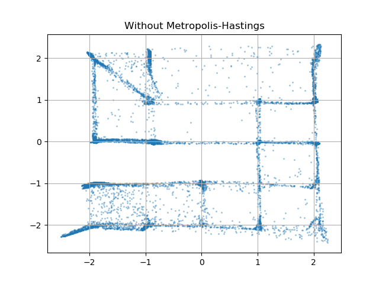
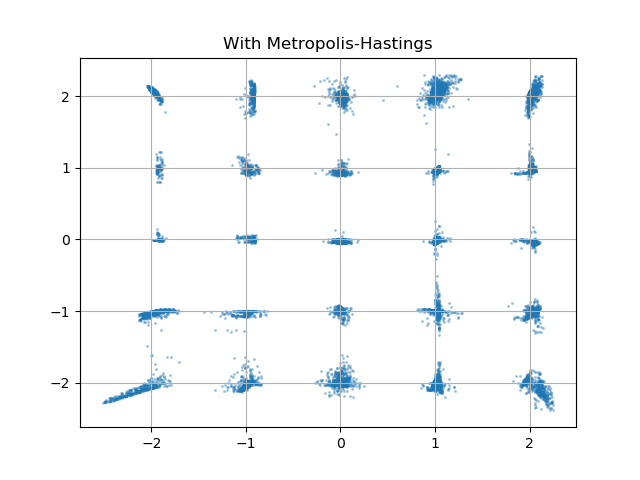

# Metropolis-Hastings GAN experiments

Hi, I am using this repository to hold research/experimentation on Metropolis-Hastings
Generative Adversarial Networks (https://arxiv.org/pdf/1811.11357.pdf).

So far, I have been able to recreate results from the gaussian mixture experiment. Here is a particular example:

 

For this example, I intentionally stopped the gan training before it was high quality, even as high quality as the 30 epoch
example in the original paper, so that I could test the feasibility of the MH approach in more likely scenarios, where the gan is not 
even close to optimal. The main qualitative metric used in the paper involves taking the Jenson-Shannon Diveregence between the distribution of those points with an L2 distance within 4 standard deviations of the mode (std=0.05) and a uniform distribution on those 25 modes. Another was the High Quality Rate, which denotes the fraction of samples which are within 4 standard devations of the nearest mode by L2 distance. For this example, the 10000 samples from the default GAN have a JSD of 0.104 and a High Quality Rate of 69.5%, whereas the 10000 samples from the MH-GAN have a JSD of 0.035 and a High Quality Rate of 93.4%. This is a drastic improvement - if this were generating images, and only 60% of images looked even somewhat realistic, we'd call it a very bad generator. The fact that we can get this kind of increase from just juicing out some unused implicit information in the discriminator is incredible!
